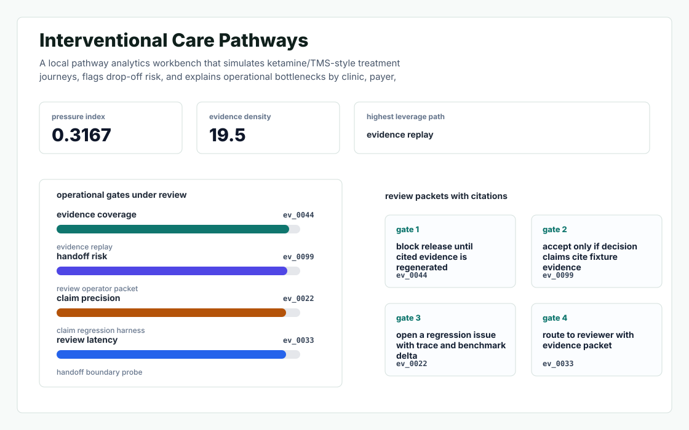
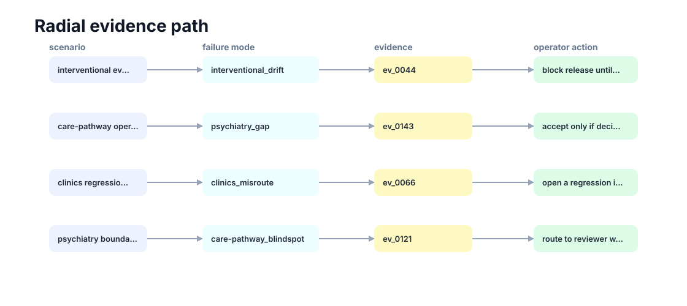

# Interventional Care Pathways

A local pathway analytics workbench that simulates ketamine/TMS-style treatment journeys, flags drop-off risk, and explains operational bottlenecks by clinic, payer, and care step.



## Why it exists

interventional psychiatry clinics need care-pathway visibility that connects patient experience, treatment cadence, insurance friction, and outcomes without flattening clinical nuance.

The project is intentionally built as a local replay harness instead of a slide. It creates fixtures, plants realistic failure modes, produces citation-locked evidence, and turns the result into a dashboard a reviewer can inspect without credentials or hosted services.

## What is inside

- Deterministic fixture generation for the company-specific risk surface.
- Strategy code in `src/interventional_care_pathways/strategy.py` with project-specific scoring and visual evidence.
- Citation-locked reports where every decision claim points to a generated evidence ID.
- Two regenerated visual artifacts: `outputs/project_working.svg` and `outputs/evidence_map.svg`.
- A portable demo pack with JSON, CSV, Markdown, HTML, SVG, benchmark, and test artifacts.



## Signals it measures

- `interventional coverage`
- `psychiatry risk`
- `clinics precision`
- `care-pathway latency`

## Failure modes it plants

- interventional drift
- psychiatry gap
- clinics misroute
- care-pathway blindspot

## Run it locally

```bash
uv sync
uv run interventional-care-pathways all
uv run pytest -q
uv run ruff check .
```

## Outputs worth opening

- `outputs/dashboard.html`
- `outputs/project_working.svg`
- `outputs/evidence_map.svg`
- `outputs/operator_brief.md`
- `outputs/decision_report.md`
- `outputs/strategy_model.json`
- `outputs/demo_pack.zip`

## Boundary

Everything runs locally against synthetic fixtures. There are no credentials, no customer records, no outreach files, and no hosted API dependency.
